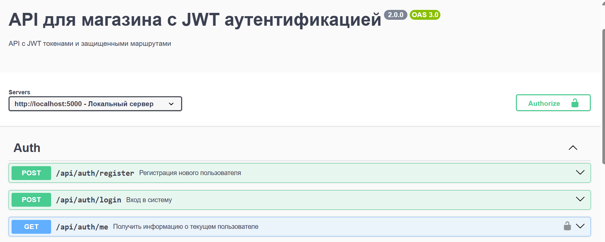

# Практические работы 7-8: Аутентификация и JWT

## Описание
Серверное приложение на Node.js с:
- Регистрацией пользователей (bcrypt)
- JWT аутентификацией
- Защищенными маршрутами
- CRUD операциями для товаров
- Swagger документацией

## Установка и запуск

1. Установите зависимости:
```bash
npm install

